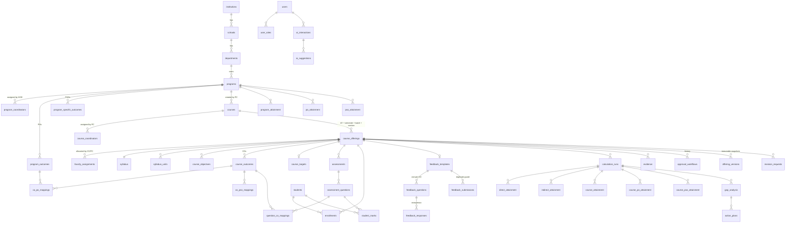

# OBE IQAC Command Center — Architecture (MVP)

## 0. Starting point

The repository was empty (only `README.md`). There was no existing framework, database, auth or UI to preserve,
so the MVP was scaffolded from scratch:

| Concern | Choice |
|---|---|
| Framework | Next.js 16 (App Router, Server Components, Server Actions), React 19, TypeScript (strict) |
| UI | Tailwind CSS 4, shadcn-style components in `src/components/ui`, Lucide icons, Recharts, Framer Motion available |
| Forms/validation | Zod on every server boundary; React Hook Form available for client forms |
| Tables | TanStack Table (installed, v8); MVP tables are server-rendered |
| Database | PostgreSQL 15+/Supabase — plain SQL migrations in `db/migrations` |
| Security | PostgreSQL Row Level Security + security-definer workflow functions + DB triggers |
| Spreadsheets | SheetJS `xlsx` (client-side parsing of uploads, server-side template/report generation) |
| PDF | jsPDF + jspdf-autotable (server-side) |
| AI | Gemini REST API, called only from the server (`src/lib/ai/gemini.ts`) |
| Package manager | npm |

## 1. Architecture

```
Browser (React client components: editors, marks upload parser, charts)
   │  Server Actions / Route handlers (auth check + Zod)
   ▼
Service layer  src/lib/services/*        ← business rules, orchestration
   │  withUser(): BEGIN; SET LOCAL ROLE obe_app; set app.user_id / app.active_role
   ▼
PostgreSQL
   ├─ RLS policies (003_rls.sql)         ← WHO may see/change WHICH rows
   ├─ Lock triggers                       ← academic data immutable unless DRAFT/RETURNED
   ├─ Workflow functions (security definer) ← only legal status transitions
   ├─ Audit triggers → audit_logs (append-only)
   └─ app.offering_progress()             ← completion checklist, stale-calculation detection

Pure domain modules  src/lib/domain/*   ← attainment engine, marks validation, Bloom, completion (unit-tested)
```

Key properties

* **Security is in the database.** The app connects with any login but every request transaction executes
  `SET LOCAL ROLE obe_app` (no BYPASSRLS, not table owner). Frontend checks only shape navigation.
* **Identity:** `app.uid()` = `app.user_id` session setting, falling back to Supabase's `request.jwt.claims.sub`,
  so the same policies work if the tables are later exposed through PostgREST/Supabase Auth.
* **Authentication:** built-in credential auth (bcrypt hashes readable only through a security-definer
  lookup; HS256 session cookie, httpOnly, 8 h). *Deviation from "Supabase Auth":* chosen so the complete
  workflow can be exercised and tested against plain PostgreSQL; replacing it with Supabase Auth (or SSO,
  Phase 6) only requires mapping the auth user id to `users.id`.
* **Storage:** evidence files go to Supabase Storage (bucket `evidence`) when `SUPABASE_SERVICE_ROLE_KEY`
  and `NEXT_PUBLIC_SUPABASE_URL` are set, otherwise to `./storage` (development).

## 2. Database ERD (core)



All tables use UUID primary keys (except the identity-keyed `audit_logs`), foreign keys, indexes on
foreign keys/hot filters, and `created_at`/`updated_at` (maintained by trigger). Other tables:
`roles`, `permissions`, `role_permissions`, `institution_settings`, `attainment_methodologies` (versioned),
`academic_years`, `semesters`, `batches`, `marks_uploads`, `correction_requests`, `reports`, `notifications`.

**Why `course_offerings`?** A *course* is catalogue data owned by the program (code, credits, L-T-P).
An *offering* is one delivery (academic year, semester, batch, section). All academic work — syllabus,
COs, CAM, assessments, marks, feedback, attainment, workflow status, versions — attaches to the offering,
so history across years is preserved and comparable.

## 3. Role-permission matrix

Coarse permissions (`src/lib/rbac.ts`, also seeded into `roles/permissions/role_permissions`):

| Permission | SA | IQAC | DIR | DEAN | HOD | PC | CC | FAC | STU | REV |
|---|---|---|---|---|---|---|---|---|---|---|
| institution.manage / users.manage / settings.manage | ✓ | | | | | | | | | |
| methodology.manage | ✓ | ✓ | | | | | | | | |
| program.create, program.assign_coordinator | ✓ | | | | ✓ | | | | | |
| program.manage (POs/PSOs/targets), course.create, course.assign_coordinator | ✓ | | | | ✓ | ✓ | | | | |
| course.allocate | ✓ | | | | | ✓ | ✓ | | | |
| course.workspace, marks.edit | | | | | | | ✓ | ✓ | | |
| course.review | ✓ | | | | ✓ | ✓ | ✓ | | | |
| attainment.program | ✓ | ✓ | ✓ | ✓ | ✓ | ✓ | | | | ✓ |
| dashboard.institution | ✓ | ✓ | ✓ | | | | | | | ✓ |
| reports.generate | ✓ | ✓ | ✓ | ✓ | ✓ | ✓ | ✓ | ✓ | | ✓ |
| audit.view | ✓ | ✓ | | | | | | | | |
| feedback.submit | | | | | | | | | ✓ | |
| ai.use | ✓ | ✓ | | | ✓ | ✓ | ✓ | ✓ | | |

Scope (enforced by RLS, `db/migrations/002` helpers + `003` policies):

| Role | Read | Write |
|---|---|---|
| SUPER_ADMIN / IQAC / DIRECTOR / REVIEWER | institution-wide | SA: structure & users; IQAC: settings, methodology, program attainment |
| DEAN | own school | — |
| HOD | own department | create programs, assign PCs, program content; **cannot edit marks/course content** |
| PROGRAM_COORDINATOR (derived from `program_coordinators`) | own programs | courses, CCs, POs/PSOs, allocation, reviews, program attainment |
| COURSE_COORDINATOR (derived from `course_coordinators`) | own courses | allocation, course content, reviews at CC stage |
| FACULTY (derived from `faculty_assignments`) | assigned offerings only | content of assigned offerings while DRAFT/RETURNED |
| STUDENT | own enrollment, COs of enrolled courses, own feedback status | feedback only via `app.submit_feedback()` |

## 4. Academic workflow (ownership)

```
HOD ──creates──▶ Program ──assigns──▶ Program Coordinator
PC  ──creates──▶ Course (catalogue) ──assigns──▶ Course Coordinator
CC/PC ──Allocate Faculty (AY, semester, batch, section, role)──▶ Course Offering + Faculty Assignment
Faculty ──notified "New Course Assigned"──▶ Course Setup Wizard (21 steps)
```

## 5. Course lifecycle

```
DRAFT ─submit─▶ SUBMITTED ─CC approves─▶ UNDER_REVIEW(PC) ─PC approves─▶ UNDER_REVIEW(HOD, if configured) ─HOD approves─▶ APPROVED ─▶ LOCKED
   ▲                 │                          │                                │
   └──── RETURNED ◀──┴──────── return (comment required) ─────────────────────────┘
RETURNED ─resubmit─▶ RESUBMITTED ─▶ (same stages)
LOCKED ─faculty requests revision (reason)─▶ PC/HOD approve ─▶ DRAFT (version + 1; approved snapshot kept)
```

* Transitions happen only in `app.transition_offering()` / `app.request_revision()` / `app.decide_revision()`;
  a trigger rejects any other change of `status`, `review_stage`, `version` or `locked_at`.
* Submission requires the full checklist (`app.offering_progress` + `submissionChecklist`) and a fresh calculation.
* On final approval a JSON snapshot of all academic data and results is stored in `offering_versions`
  (label e.g. "2025-26 Version 1").
* Lock triggers make syllabus, objectives, COs, targets, CAM, assessments, questions, mappings, enrollment,
  marks, feedback forms, attainment and gap rows immutable outside DRAFT/RETURNED — even for direct SQL.

## 6. Attainment calculation architecture

Pure engine: `src/lib/domain/attainment.ts` (unit-tested, `ENGINE_VERSION`). Methodology:
`src/lib/domain/methodology.ts`, stored versioned in `attainment_methodologies` (institution default,
optional program override). Nothing is hard-coded.

| Stage | Formula (defaults) |
|---|---|
| Student CO score | Σ marks on questions mapped to the CO ÷ Σ their max × 100 (questions without a mark record excluded). Option: weight per-assessment CO% by assessment weightage. |
| Direct attainment | students with CO score ≥ threshold (60) ÷ students assessed × 100 |
| Indirect attainment | mean Likert rating ÷ scale max × 100 (option: % ratings ≥ agree level) |
| Final CO attainment | Direct × w<sub>d</sub> + Indirect × w<sub>i</sub> (80/20, 70/30, 60/40, custom; must sum to 100) |
| Target | CO target → course target → program target → institution default |
| Level | configurable bands (≥70 → 3, ≥60 → 2, ≥50 → 1) |
| Gap class | gap ≥ 0 Achieved; ≥ −near (5) Near target; ≥ −critical (15) Below target; else Critical |
| Course PO/PSO | Σ(CO final × correlation) ÷ Σ correlation |
| Program PO/PSO | weighted average over contributing courses: course-, credit- or mapping-strength-weighted; scope all calculated (provisional) or locked only |

Every run is appended to `calculation_runs` with a methodology snapshot, input summary, engine version,
user and timestamp; result rows carry `formula` and `inputs`; older rows are kept with `is_current = false`.
Stale detection: triggers bump `course_offerings.calc_inputs_changed_at` when any input changes.

## 7. AI architecture

```
Client (AI button) → Server Action → services/ai.ts
   ├─ permission & institution AI switch check
   ├─ builds prompt from course design text + AGGREGATED results only (no names, roll numbers, marks rows)
   ├─ gemini.ts (server-only fetch, key from env, JSON response, 60 s timeout)
   ├─ Zod-validates the model output
   ├─ logs ai_interactions (user, feature, input metadata, response, status, latency)
   └─ stores ai_suggestions (PENDING) → faculty accept / modify / reject (decided_by, decided_at, final_value)
```

Features (MVP): syllabus analysis/structuring, suggest objectives, suggest COs, CO review
(measurability/Bloom/improved statement), suggest CO-PO and CO-PSO matrix, gap analysis with corrective
actions. Deterministic helpers that do **not** use AI: Bloom verb/measurability check and pattern detection
(weak COs, direct/indirect discrepancy, low-scoring questions, PO gaps). When `GEMINI_API_KEY` is absent the
UI says so explicitly; nothing is faked.

## 8. API architecture

* **Server Actions** (`src/app/actions/*`): authenticate → coarse permission → service → `ActionResult`.
* **Route handlers:** `GET /api/reports?type&format&offeringId|programId&academicYearId`,
  `GET /api/marks-template/:offeringId`, `GET /api/evidence/:id`.
* **Services** (`src/lib/services/*`) are framework-independent and are exercised directly by the
  integration tests.

## 9. UI route structure

| Route | Purpose |
|---|---|
| `/login` | sign in |
| `/dashboard` | role-aware home (faculty courses, PC/HOD program completion, review queue, IQAC summary) |
| `/programs`, `/programs/:id` | HOD creates programs, assigns PC; PC manages POs/PSOs, targets, courses |
| `/courses`, `/courses/:id` | course list; assign CC; **Allocate Faculty**; offerings |
| `/my-courses` | faculty "My Assigned Courses" |
| `/workspace/:offeringId[/:step]` | Course Setup Wizard: profile, syllabus, objectives, outcomes, bloom, targets, co-po, co-pso, assessments, question-mapping, students, marks, direct, feedback, indirect, attainment, contribution, gaps, evidence, report, submission |
| `/reviews` | review queue (CC/PC/HOD), revision requests |
| `/student`, `/student/feedback/:offeringId` | student courses and CO feedback |
| `/attainment`, `/attainment/:programId` | program PO/PSO attainment, course×PO heatmap |
| `/iqac` | IQAC Command Center with filters and completion monitor |
| `/reports` | PDF/Excel/CSV reports |
| `/admin/structure`, `/admin/users`, `/admin/settings`, `/admin/audit` | administration |
| `/notifications` | in-app notifications |
